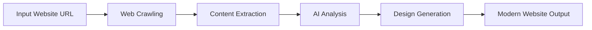

# 🚀 AI Website Modernizer

**Transform any website into a modern, responsive, and SEO-optimized experience using Google Gemini AI.**

[](https://www.python.org/)
[](LICENSE)
[](https://streamlit.io/)

## 🎯 Overview

AI Website Modernizer is an intelligent web transformation tool that analyzes existing websites and automatically rebuilds them with modern design principles, improved user experience, and optimized performance. Using advanced AI capabilities, it creates cohesive, responsive websites that maintain brand identity while dramatically improving functionality.

---

## ✨ Key Features

### 🤖 **Intelligent Website Analysis**
- **Smart Content Extraction**: Automatically crawls and analyzes website structure, content, and design patterns
- **Comprehensive Data Collection**: Captures HTML, CSS, images, and copy with configurable depth and page limits
- **Content Understanding**: AI processes all page data simultaneously for holistic redesign approach

### 🎨 **AI-Powered Modernization**
- **Holistic Redesign**: Google Gemini AI analyzes entire site structure to create cohesive, modern designs
- **Mobile-First Approach**: Automatically optimizes for responsive design and mobile user experience
- **SEO Optimization**: Implements modern SEO best practices and performance improvements
- **Brand Consistency**: Maintains brand identity while upgrading design language and user experience

### 🔧 **Technical Excellence**
- **Structured Output**: Generates clean, maintainable code with global stylesheets and organized HTML
- **Scalable Architecture**: Three-stage pipeline (Crawl → AI Processing → Generation) for reliable results
- **Security-First**: Secure API key handling and path traversal protection
- **Error Resilience**: Comprehensive timeout handling and graceful error recovery

### 📊 **User-Friendly Interface**
- **Interactive Dashboard**: Streamlit-powered UI for easy website transformation
- **Real-Time Monitoring**: Live progress tracking and detailed logging
- **Preview Capability**: Instant preview of transformed pages
- **Process Transparency**: Clear status indicators and detailed feedback

## 🔄 How It Works



1. **🕷️ Web Crawling**: Automatically discovers and crawls website pages using Selenium WebDriver
2. **📝 Content Extraction**: Extracts and structures HTML, CSS, images, and text content
3. **🧠 AI Analysis**: Google Gemini processes all content simultaneously for comprehensive understanding
4. **🎨 Design Generation**: AI creates modern, responsive design with improved UX and SEO
5. **📦 Output Generation**: Produces clean, organized website files ready for deployment

---

## 📋 Prerequisites
- Python 3.9+
- Chrome browser and ChromeDriver (for Selenium)
- Google Gemini API key ([Get one here](https://ai.google.dev/gemini-api/docs/quickstart?lang=python))

## 🚀 Quick Start

### 1. **Clone & Setup**
```bash
git clone <repository-url>
cd ai-website-modernizer
```

### 2. **Environment Setup**
```bash
# Create virtual environment
python3 -m venv venv
source venv/bin/activate  # On Windows: venv\Scripts\activate

# Install pinned dependencies for reproducible builds
pip install -r requirements.txt

# For development: install pip-tools to manage dependencies
pip install pip-tools

# To update dependencies: edit requirements.in, then run:
# pip-compile requirements.in
```

### 3. **API Configuration**
```bash
# Set your Google Gemini API key
export GOOGLE_GEMINI_API_KEY=your-api-key-here

# For permanent setup (recommended)
echo 'export GOOGLE_GEMINI_API_KEY=your-api-key-here' >> ~/.bashrc
source ~/.bashrc
```

> 🔑 **Get your API key**: [Google AI Studio](https://ai.google.dev/gemini-api/docs/quickstart?lang=python)

### 4. **Launch Dashboard**

**🚀 One-Click Startup (Recommended)**
```bash
# macOS/Linux
./start.sh

# Windows
start.bat
```

**Manual Launch**
```bash
streamlit run dashboard.py
```

Open your browser to `http://localhost:8501` and start transforming websites! 🎉

> The startup scripts automatically handle virtual environment creation, dependency installation, and dashboard launch.

---

## 💻 Usage Options

### 🎯 **Recommended: Interactive Dashboard**
```bash
streamlit run dashboard.py
```
- **User-friendly interface** with real-time progress tracking
- **One-click transformation** from URL input to modernized website
- **Live preview** of transformed pages
- **Detailed logging** and status monitoring

### 🔧 **Advanced: Command Line Interface**

#### Crawl Website
```bash
python crawl_site.py https://example.com --max_pages 10 --depth 2
```

#### AI Transformation
```bash
python remake_site_with_ai.py example.com --model gemini-2.5-flash-preview-05-20
```

**Available Models:**
- `gemini-2.5-flash-preview-05-20` (default, fast)
- `gemini-1.5-pro-latest` (comprehensive, large context)

## 📁 Output Structure

```
📦 example.com/                    # Original crawled data
 ┣ 📂 home/
 ┃ ┣ 📄 url.txt                   # Page URL
 ┃ ┣ 📄 page.html                 # Original HTML
 ┃ ┣ 📄 copy.txt                  # Extracted text content
 ┃ ┣ 📄 images.txt                # Image URLs
 ┃ ┗ 📄 css.txt                   # CSS styles
 ┣ 📂 about/
 ┃ ┗ 📄 ...
 ┗ 📄 crawl_manifest.json         # Crawl metadata

📦 example.com_ai/                 # 🎨 AI-Enhanced Website
 ┣ 📄 global_styles.css           # Modern global stylesheet
 ┣ 📂 home/
 ┃ ┣ 📄 index.html                # ✨ Modernized HTML
 ┃ ┗ 📄 original_*.txt            # Reference files
 ┗ 📂 about/
   ┗ 📄 index.html
```

## 🏗️ Architecture

### **Three-Stage Pipeline**
```
🕷️ Crawl → 🧠 AI Processing → 📦 Generation
```

1. **Crawler Module** (`crawl_site.py`)
   - Selenium WebDriver for JavaScript-rendered sites
   - Structured content extraction and validation
   - Configurable depth and page limits

2. **AI Processing** (`remake_site_with_ai.py`)
   - Google Gemini integration with security-first design
   - Holistic content analysis and design generation
   - Enhanced path traversal protection

3. **Dashboard Interface** (`dashboard.py`)
   - Streamlit-powered user interface
   - Real-time progress monitoring
   - Manifest-based reliable inter-process communication

## 🧠 AI & Technical Details

### **Prompt Engineering**
- **Holistic Analysis**: All crawled content processed simultaneously for cohesive design
- **Design Principles**: Mobile-first responsiveness, SEO optimization, accessibility
- **Brand Preservation**: Maintains original brand identity while modernizing experience
- **Structured Output**: JSON-formatted response with global CSS and individual page HTML

### **Security & Reliability**
- **🔒 Secure API Handling**: Environment-based API key management
- **🛡️ Path Traversal Protection**: Enhanced filename validation for AI-generated content
- **⏱️ Timeout Management**: Prevents hanging on unresponsive pages
- **📊 Manifest Communication**: Reliable inter-script communication replacing brittle stdout parsing

### **Performance Considerations**
- **Context Window**: Leverages large context windows (1M+ tokens) for comprehensive analysis
- **Scalable Architecture**: Modular design supports easy enhancement and maintenance
- **Error Resilience**: Graceful handling of network issues, API limits, and malformed content

## 🤝 Contributing

We welcome contributions! Here's how you can help:

### **Areas for Enhancement**
- 🌐 **Additional AI Models**: Support for Claude, GPT-4, or other language models
- 🚀 **Performance Optimization**: Parallel processing for large sites
- 🎨 **Design Templates**: Pre-built design themes and templates
- 📱 **Mobile Optimization**: Enhanced mobile-specific optimizations
- 🔍 **SEO Features**: Advanced SEO analysis and recommendations

### **Development Setup**
```bash
# Fork the repository and clone your fork
git clone https://github.com/your-username/ai-website-modernizer.git

# Create feature branch
git checkout -b feature/your-feature-name

# Make changes and test thoroughly
python -m pytest tests/  # When tests are added

# Submit pull request
```

## 📈 Roadmap

- [ ] **Multi-Model Support**: Integration with Claude, GPT-4, and other AI models
- [ ] **Template System**: Pre-built modern design templates
- [ ] **Batch Processing**: Support for multiple websites simultaneously
- [ ] **Performance Analytics**: Before/after performance comparison
- [ ] **Custom Branding**: Advanced brand guideline integration
- [ ] **API Development**: RESTful API for programmatic access

---

## 🛠️ Troubleshooting

### **Common Issues & Solutions**

| Issue | Solution |
|-------|----------|
| **Missing Dependencies** | Run `pip install -r requirements.txt` in activated virtual environment |
| **ChromeDriver Issues** | Ensure ChromeDriver matches Chrome version and is in PATH |
| **API Key Not Found** | Verify `GOOGLE_GEMINI_API_KEY` environment variable is set |
| **Timeout Errors** | Check internet connection; large sites may need multiple attempts |
| **JSON Parse Errors** | AI model occasionally returns malformed JSON; retry the process |
| **Memory Issues** | Use `gemini-2.5-flash-preview-05-20` for large sites instead of pro model |

### **Debug Mode**
```bash
# Enable verbose logging
export DEBUG_MODE=1
streamlit run dashboard.py
```

### **Getting Help**
- 📖 **Documentation**: Check function docstrings and comments
- 🐛 **Issues**: Report bugs via GitHub Issues
- 💬 **Discussions**: Join community discussions for usage questions
- 📧 **Contact**: Reach out for enterprise or custom solutions

---

## 📄 License

MIT License - see [LICENSE](LICENSE) file for details.

---