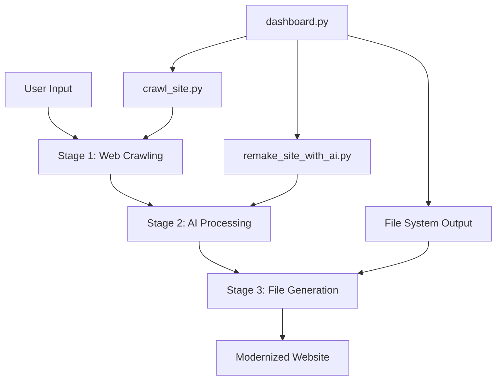

# 🏗️ AI Website Modernizer - Architecture Guide

---
**FILE**: ARCHITECTURE.md  
**PURPOSE**: Technical architecture and system design documentation  
**AUDIENCE**: engineers  
**CODE_REFERENCES**: 45  
---

## System Overview

AI Website Modernizer is a Python-based application that transforms existing websites into modern, responsive designs using Google Gemini AI. The system follows a three-stage pipeline architecture with clear separation of concerns, robust error handling, and security-first design principles.

## 🔧 Technology Stack

### Core Framework
- **Python 3.9+**: Main programming language ([`requirements.txt`](./requirements.txt))
- **Selenium WebDriver**: Browser automation for content crawling ([`crawl_site.py:setup_driver()`](./crawl_site.py#L68-L85))
- **Google Gemini AI**: AI-powered website generation ([`remake_site_with_ai.py:gemini_generate_entire_site()`](./remake_site_with_ai.py#L32-L165))
- **Streamlit**: Interactive dashboard interface ([`dashboard.py:st.set_page_config()`](./dashboard.py#L15-L20))

### Key Dependencies
```python
# From requirements.txt
selenium==4.34.0              # Web crawling automation
google-genai==1.23.0          # Gemini AI integration  
streamlit==1.46.1             # Dashboard UI framework
beautifulsoup4==4.13.4        # HTML parsing and validation
termcolor==3.1.0              # Terminal output coloring
```

### Browser Integration
- **Chrome WebDriver**: Headless browser automation ([`crawl_site.py:chrome_options`](./crawl_site.py#L71-L75))
- **BeautifulSoup**: HTML/CSS parsing and content extraction ([`crawl_site.py:BeautifulSoup`](./crawl_site.py#L121))

## 🏗️ Architecture Patterns

### Three-Stage Pipeline Architecture



### Service-Oriented Design
- **Crawler Service**: [`crawl_site.py`](./crawl_site.py) - Independent web crawling module
- **AI Service**: [`remake_site_with_ai.py`](./remake_site_with_ai.py) - AI processing and generation
- **Dashboard Service**: [`dashboard.py`](./dashboard.py) - User interface and orchestration

### Data Flow Architecture
```
Input URL → Security Validation → Content Extraction → AI Analysis → HTML/CSS Generation → File Output
```

## 📦 Component Architecture

### 1. Web Crawler Module ([`crawl_site.py`](./crawl_site.py))

#### Core Components
- **Driver Management**: [`setup_driver()`](./crawl_site.py#L68-L85)
  ```python
  def setup_driver():
      chrome_options = Options()
      chrome_options.add_argument('--headless')
      driver = webdriver.Chrome(options=chrome_options)
      driver.set_page_load_timeout(30)  # Timeout protection
  ```

- **Security Layer**: [`is_safe_url()`](./crawl_site.py#L29-L66)
  ```python
  def is_safe_url(url: str) -> bool:
      # SSRF protection - validates against private/reserved IPs
      ip_obj = ipaddress.ip_address(ip_str)
      return not (ip_obj.is_private or ip_obj.is_loopback)
  ```

- **Content Extraction**: [`get_page_content()`](./crawl_site.py#L99-L157)
  - HTML content extraction
  - CSS file discovery and inline styles
  - Image URL collection  
  - Text content cleaning
  - Link discovery for crawling

#### Data Structures
```python
# File naming constants (crawl_site.py:22-27)
COPY_FILENAME = "copy.txt"      # Extracted text content
CSS_FILENAME = "css.txt"        # CSS styles and files  
HTML_FILENAME = "page.html"     # Original HTML
IMAGES_FILENAME = "images.txt"  # Image URLs
URL_FILENAME = "url.txt"        # Page URL
```

#### Crawling Algorithm
1. **URL Normalization**: [`urlparse`](./crawl_site.py#L281-L284) removes fragments and trailing slashes
2. **Breadth-First Traversal**: [`to_visit_queue`](./crawl_site.py#L312) maintains crawling queue
3. **Duplicate Prevention**: [`visited_path_query`](./crawl_site.py#L311) tracks processed URLs
4. **Depth Control**: [`current_depth`](./crawl_site.py#L334-L336) limits crawling depth

### 2. AI Processing Module ([`remake_site_with_ai.py`](./remake_site_with_ai.py))

#### Core Components
- **API Management**: [`load_gemini_api_key()`](./remake_site_with_ai.py#L20-L30)
  ```python
  def load_gemini_api_key() -> Optional[str]:
      api_key = os.getenv("GOOGLE_GEMINI_API_KEY")
      # Secure environment-based API key loading
  ```

- **AI Generation**: [`gemini_generate_entire_site()`](./remake_site_with_ai.py#L32-L165)
  - Prompt loading from [`prompts/rebuild_prompt.txt`](./prompts/rebuild_prompt.txt)
  - Context window optimization for large sites
  - JSON response parsing and validation
  - Error handling for API failures

#### Prompt Engineering
- **Template System**: External prompt file for maintainability
- **Structured Input**: XML-formatted page data for AI processing
- **JSON Output**: Structured response format for reliable parsing

```python
# AI response structure validation (remake_site_with_ai.py:126-136)
required_keys = ["site_structure_decision", "global_css", "html_files"]
if not all(key in ai_response for key in required_keys):
    raise ValueError(f"Missing required keys in AI response")
```

#### Security Features
- **Path Traversal Protection**: [`filename validation`](./remake_site_with_ai.py#L372-L387)
  ```python
  # Enhanced security validation
  normalized_filename = os.path.normpath(filename)
  if ".." in normalized_filename or "/" in normalized_filename:
      # Block potentially unsafe filenames
  ```

- **Content Validation**: HTML parsing with BeautifulSoup for malformed content detection

### 3. Dashboard Interface ([`dashboard.py`](./dashboard.py))

#### Core Components
- **Session State Management**: [`st.session_state`](./dashboard.py#L24-L39)
  ```python
  # Persistent state across Streamlit reruns
  if 'current_preview_file' not in st.session_state:
      st.session_state.current_preview_file = None
  ```

- **Process Orchestration**: [`run_full_process()`](./dashboard.py#L184-L272)
  - URL validation and domain parsing
  - Sequential subprocess execution
  - Real-time progress tracking
  - Error handling and user feedback

- **Real-time Monitoring**: [`run_subprocess_and_log()`](./dashboard.py#L139-L182)
  ```python
  process = subprocess.Popen(command_array, 
                           stdout=subprocess.PIPE, 
                           stderr=subprocess.STDOUT, 
                           text=True, bufsize=1)
  ```

#### UI Architecture
- **Component-Based Layout**: Streamlit columns and containers
- **Real-time Updates**: Session state for live progress tracking
- **Preview System**: [`display_preview()`](./dashboard.py#L113-L136) with HTML modification

## 🔐 Security Architecture

### SSRF Protection
- **IP Validation**: [`is_safe_url()`](./crawl_site.py#L29-L66) prevents access to private networks
- **DNS Resolution**: Socket-based hostname validation
- **IP Range Filtering**: Blocks private, loopback, and reserved IP ranges

### Path Traversal Prevention
- **Filename Sanitization**: [`os.path.normpath()`](./remake_site_with_ai.py#L379) validation
- **Character Filtering**: Control character detection and removal
- **Directory Traversal**: Prevention of `../` and absolute path attacks

### API Security
- **Environment Variables**: Secure API key storage
- **Timeout Protection**: Request timeout limits
- **Error Sanitization**: Sensitive information removal from error messages

## 📊 Data Architecture

### File System Organization
```
project_root/
├── crawl_site.py           # Web crawler module
├── remake_site_with_ai.py  # AI processing module  
├── dashboard.py            # Streamlit dashboard
├── prompts/
│   └── rebuild_prompt.txt  # AI prompt template
├── requirements.txt        # Python dependencies
└── venv/                   # Virtual environment

Generated Output:
domain_name/                # Crawled data
├── home/
│   ├── url.txt
│   ├── page.html
│   ├── copy.txt
│   ├── css.txt
│   └── images.txt
├── about/
└── crawl_manifest.json

domain_name_ai/             # AI-generated site
├── global_styles.css
├── index.html
├── about.html
└── original_crawled_data/
```

### Inter-Process Communication
- **Manifest Files**: [`crawl_manifest.json`](./crawl_site.py#L386-L412) for reliable data passing
- **Stdout Parsing**: Legacy fallback for backward compatibility
- **File System**: Primary communication mechanism between modules

## ⚡ Performance Architecture

### Optimization Strategies
- **Context Window Management**: Large input handling for AI processing
- **Timeout Controls**: [`driver.set_page_load_timeout(30)`](./crawl_site.py#L78) prevents hanging
- **Memory Management**: Streaming output processing for large responses
- **Concurrent Processing**: Subprocess-based parallel execution

### Scalability Considerations
- **Modular Design**: Independent module execution
- **Configurable Limits**: [`DEFAULT_MAX_PAGES`](./crawl_site.py#L19), [`DEFAULT_CRAWL_DEPTH`](./crawl_site.py#L20)
- **Error Recovery**: Graceful degradation on component failures

## 🔄 Error Handling Architecture

### Exception Hierarchy
```python
# Crawler exceptions (crawl_site.py)
TimeoutException        # Page load timeouts
socket.gaierror        # DNS resolution failures  
selenium.WebDriverException  # Browser automation errors

# AI processing exceptions (remake_site_with_ai.py)
json.JSONDecodeError   # AI response parsing failures
ValueError             # Response structure validation
Exception              # General API interaction errors
```

### Recovery Mechanisms
- **Retry Logic**: Configurable retry attempts for network failures
- **Graceful Degradation**: Partial results on component failures
- **User Feedback**: Clear error messages with actionable solutions

## 🚀 Deployment Architecture

### Environment Requirements
- **Python Runtime**: Version 3.9+ compatibility
- **Chrome Browser**: WebDriver dependency
- **Environment Variables**: API key configuration
- **Network Access**: Outbound HTTP/HTTPS for crawling and AI API

### Containerization Considerations
```dockerfile
# Potential Docker setup
FROM python:3.9-slim
RUN apt-get update && apt-get install -y chromium-driver
COPY requirements.txt .
RUN pip install -r requirements.txt
```

## 🔧 Configuration Architecture

### Environment Configuration
```bash
# Required environment variables
GOOGLE_GEMINI_API_KEY=your-api-key-here

# Optional debug configuration  
DEBUG_MODE=1
```

### Runtime Configuration
- **Crawling Parameters**: [`argparse`](./crawl_site.py#L270-L277) for CLI configuration
- **AI Model Selection**: [`--model`](./remake_site_with_ai.py#L170-L171) parameter
- **Temperature Control**: [`--temperature`](./remake_site_with_ai.py#L172-L173) for AI creativity

## 📈 Monitoring & Observability

### Logging Architecture
- **Colored Terminal Output**: [`termcolor`](./crawl_site.py#L5) for status indication
- **Progress Tracking**: Real-time status updates in dashboard
- **Error Reporting**: Detailed exception information with stack traces

### Metrics Collection
- **Crawling Statistics**: Page count, processing time, success/failure rates
- **AI Processing**: Response time, token usage, error rates  
- **User Interaction**: Dashboard usage patterns and common workflows

## 🔮 Future Architecture Considerations

### Extensibility Points
- **Multi-Model Support**: Plugin architecture for different AI providers
- **Template System**: Modular design template integration
- **Parallel Processing**: Concurrent crawling and processing capabilities
- **API Development**: RESTful API layer for programmatic access

### Performance Enhancements
- **Caching Layer**: Redis integration for crawled content
- **Queue System**: Background job processing with Celery
- **Load Balancing**: Horizontal scaling for high-volume processing

---

## 🏛️ Architectural Principles

### Single Responsibility
Each module has a clear, focused purpose:
- **Crawler**: Content extraction only
- **AI Processor**: Design generation only  
- **Dashboard**: User interface only

### Loose Coupling
- File-based communication between modules
- Environment-based configuration
- Independent module execution capabilities

### Security by Design
- Input validation at every boundary
- Principle of least privilege
- Defense in depth with multiple security layers

### Fail-Safe Operation
- Graceful error handling
- Partial result preservation
- Clear user feedback on failures

---

*This architecture supports the transformation of legacy websites into modern, responsive designs while maintaining security, performance, and reliability standards.*